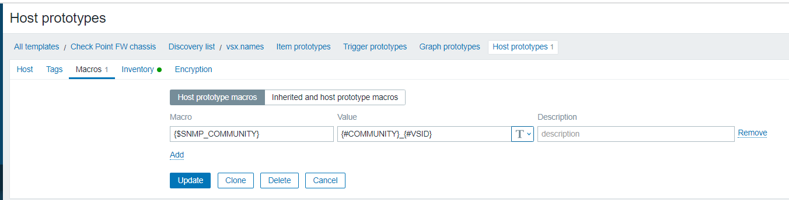

# Create virtual hosts per every VSX

Solution relies on the functionality which allows to use different community names to query each VSX
https://sc1.checkpoint.com/documents/R80.30/WebAdminGuides/EN/CP_R80.30_VSX_AdminGuide/html_frameset.htm?topic=documents/R80.30/WebAdminGuides/EN/CP_R80.30_VSX_AdminGuide/203624

https://sc1.checkpoint.com/documents/R81/WebAdminGuides/EN/CP_R81_VSX_AdminGuide/Topics-VSXG/SNMP-Monitoring.htm

For example to query chassis1 we use:
```
snmpwalk -v'2c' -c'public' 10.1.1.15 .
```

To query VSID1, VSID2, VSID3 behind chassis1, we use "same everything" except the community name contains a suffix.
```
snmpwalk -v'2c' -c'public_1' 10.1.1.15 .
snmpwalk -v'2c' -c'public_2' 10.1.1.15 .
snmpwalk -v'2c' -c'public_3' 10.1.1.15 .
..
```

If you have managed to retrieve information by using suffix, feel free to continue reading and apply this template.

## Template

an YAML archive include 2 template objects:

* Check Point FW chassis

* Check Point VSX

This template is compatible with Zabbix 6.0. It cannot be backported to Zabbix 5.0 because the host prototype functionality allow to customize different SNMP community names only starting with Zabbix version 6.0.
 
## Configuration

Create a chassis host and assign "Check Point FW chassis" template. The other "Check Point VSX" template is included inside.


Configure host level macros:
```
{$COMMUNITY} = community123
{$HOST.HOST} = HostName123
  {$HOST.IP} = 10.1.1.15
```


We do not need to manually or individually assign "Check Point VSX" template to any host(s)!

## How it works

The first template is doing an "snmpwalk" on chassis:
```
snmpwalk -v'2c' -c'public' ip.address.of.chassis .1.3.6.1.6.3.16.1.1.1.1
```

This will find the names of VSID. A regular expression is applied to pick up only "VSID codenames":
```
^vsid[0-9]+$
```

We are not picking up human friendly name of VSX, because we need to extract a number (a suffix) which later will be used with community name.

After finding all VSIDs, there is extra JavaScript preprocessing linked which is extracting only the ID number of VSID. Output from discovery will look like
```
[
	{
		"{#HOST.HOST}": "HostName123",
		"{#HOST.IP}": "10.1.1.15",
		"{#COMMUNITY}": "community123",
		"{#VSX}": "vsid1",
		"{#VSID}": "1"
	},
	{
		"{#HOST.HOST}": "HostName123",
		"{#HOST.IP}": "10.1.1.15",
		"{#COMMUNITY}": "community123",
		"{#VSX}": "vsid2",
		"{#VSID}": "2"
	}
]
```

Through the functionality of host prototype, it creates a new virtual host objects with name "{#HOST.HOST} {#VSX}". They will use the data collection like:
```
snmpwalk -v'2c' -c'{#COMMUNITY}_{#VSID}' {#HOST.IP} .

```

"snmpwalk" is not used in template. It's just an expression to describe how it works.

Screenshots from template to explain how and why it works:




## More about template

It's a quite flat template which has been designed with a help of official modules from Zabbix 6.0:

* HOST-RESOURCES-MIB memory by SNMP

* HOST-RESOURCES-MIB storage by SNMP

* Generic by SNMP

* Interfaces by SNMP

The nesting has been still used because an indivudual VSX monitoring works very well when applied to chassis

Static (not discovery) items included:
```
.1.3.6.1.4.1.2620.1.6.16.7.0
CHECKPOINT-MIB::svnApplianceProductName.0
svnApplianceProductName OBJECT-TYPE
  -- FROM       CHECKPOINT-MIB
  -- TEXTUAL CONVENTION DisplayString
  SYNTAX        OCTET STRING (0..255)
  DISPLAY-HINT  "255a"
  MAX-ACCESS    read-only
  STATUS        current
  DESCRIPTION   "Appliance Product Name"
::= { iso(1) org(3) dod(6) internet(1) private(4) enterprises(1) checkpoint(2620) products(1) svn(6) svnApplianceInfo(16) svnApplianceProductName(7) 0 }


.1.3.6.1.4.1.2620.1.6.16.3.0
CHECKPOINT-MIB::svnApplianceSerialNumber.0
svnApplianceSerialNumber OBJECT-TYPE
  -- FROM       CHECKPOINT-MIB
  -- TEXTUAL CONVENTION DisplayString
  SYNTAX        OCTET STRING (0..255)
  DISPLAY-HINT  "255a"
  MAX-ACCESS    read-only
  STATUS        current
  DESCRIPTION   "Appliance Serial Number"
::= { iso(1) org(3) dod(6) internet(1) private(4) enterprises(1) checkpoint(2620) products(1) svn(6) svnApplianceInfo(16) svnApplianceSerialNumber(3) 0 }


.1.3.6.1.4.1.2620.1.1.1.0
CHECKPOINT-MIB::fwModuleState.0
fwModuleState OBJECT-TYPE
  -- FROM       CHECKPOINT-MIB
  -- TEXTUAL CONVENTION DisplayString
  SYNTAX        OCTET STRING (0..255)
  DISPLAY-HINT  "255a"
  MAX-ACCESS    read-only
  STATUS        current
  DESCRIPTION   "The state of the fw module"
::= { iso(1) org(3) dod(6) internet(1) private(4) enterprises(1) checkpoint(2620) products(1) fw(1) fwModuleState(1) 0 }


.1.3.6.1.4.1.2620.1.1.25.2.0
CHECKPOINT-MIB::fwInstallTime.0
fwInstallTime OBJECT-TYPE
  -- FROM       CHECKPOINT-MIB
  -- TEXTUAL CONVENTION DisplayString
  SYNTAX        OCTET STRING (0..255)
  DISPLAY-HINT  "255a"
  MAX-ACCESS    read-only
  STATUS        current
  DESCRIPTION   "Policy install time"
::= { iso(1) org(3) dod(6) internet(1) private(4) enterprises(1) checkpoint(2620) products(1) fw(1) fwPolicyStat(25) fwInstallTime(2) 0 }


.1.3.6.1.4.1.2620.1.5.11.0
CHECKPOINT-MIB::haWorkMode.0
haWorkMode OBJECT-TYPE
  -- FROM       CHECKPOINT-MIB
  -- TEXTUAL CONVENTION DisplayString
  SYNTAX        OCTET STRING (0..255)
  DISPLAY-HINT  "255a"
  MAX-ACCESS    read-only
  STATUS        current
  DESCRIPTION   "Working mode"
::= { iso(1) org(3) dod(6) internet(1) private(4) enterprises(1) checkpoint(2620) products(1) ha(5) haWorkMode(11) 0 }


.1.3.6.1.4.1.2620.1.5.6.0
CHECKPOINT-MIB::haState.0
haState OBJECT-TYPE
  -- FROM       CHECKPOINT-MIB
  -- TEXTUAL CONVENTION DisplayString
  SYNTAX        OCTET STRING (0..255)
  DISPLAY-HINT  "255a"
  MAX-ACCESS    read-only
  STATUS        current
  DESCRIPTION   "HA state"
::= { iso(1) org(3) dod(6) internet(1) private(4) enterprises(1) checkpoint(2620) products(1) ha(5) haState(6) 0 }


.1.3.6.1.4.1.2620.1.1.25.2.0
CHECKPOINT-MIB::fwInstallTime.0
fwInstallTime OBJECT-TYPE
  -- FROM       CHECKPOINT-MIB
  -- TEXTUAL CONVENTION DisplayString
  SYNTAX        OCTET STRING (0..255)
  DISPLAY-HINT  "255a"
  MAX-ACCESS    read-only
  STATUS        current
  DESCRIPTION   "Policy install time"
::= { iso(1) org(3) dod(6) internet(1) private(4) enterprises(1) checkpoint(2620) products(1) fw(1) fwPolicyStat(25) fwInstallTime(2) 0 }


.1.3.6.1.4.1.2620.1.6.16.9.0
CHECKPOINT-MIB::svnApplianceManufacturer.0
svnApplianceManufacturer OBJECT-TYPE
  -- FROM       CHECKPOINT-MIB
  -- TEXTUAL CONVENTION DisplayString
  SYNTAX        OCTET STRING (0..255)
  DISPLAY-HINT  "255a"
  MAX-ACCESS    read-only
  STATUS        current
  DESCRIPTION   "Appliance Manufacturer"
::= { iso(1) org(3) dod(6) internet(1) private(4) enterprises(1) checkpoint(2620) products(1) svn(6) svnApplianceInfo(16) svnApplianceManufacturer(9) 0 }


.1.3.6.1.4.1.2620.1.6.7.4.5.0
CHECKPOINT-MIB::memFreeReal64.0
memFreeReal64 OBJECT-TYPE
  -- FROM       CHECKPOINT-MIB
  -- TEXTUAL CONVENTION DisplayString
  SYNTAX        OCTET STRING (0..255)
  DISPLAY-HINT  "255a"
  MAX-ACCESS    read-only
  STATUS        current
  DESCRIPTION   "Free real memory"
::= { iso(1) org(3) dod(6) internet(1) private(4) enterprises(1) checkpoint(2620) products(1) svn(6) svnPerf(7) svnMem64(4) memFreeReal64(5) 0 }


.1.3.6.1.4.1.2620.1.6.7.4.3.0
CHECKPOINT-MIB::memTotalReal64.0
memTotalReal64 OBJECT-TYPE
  -- FROM       CHECKPOINT-MIB
  -- TEXTUAL CONVENTION DisplayString
  SYNTAX        OCTET STRING (0..255)
  DISPLAY-HINT  "255a"
  MAX-ACCESS    read-only
  STATUS        current
  DESCRIPTION   "Total real memory"
::= { iso(1) org(3) dod(6) internet(1) private(4) enterprises(1) checkpoint(2620) products(1) svn(6) svnPerf(7) svnMem64(4) memTotalReal64(3) 0 }


.1.3.6.1.4.1.2620.1.6.7.4.4.0
CHECKPOINT-MIB::memActiveReal64.0
memActiveReal64 OBJECT-TYPE
  -- FROM       CHECKPOINT-MIB
  -- TEXTUAL CONVENTION DisplayString
  SYNTAX        OCTET STRING (0..255)
  DISPLAY-HINT  "255a"
  MAX-ACCESS    read-only
  STATUS        current
  DESCRIPTION   "Active real memory"
::= { iso(1) org(3) dod(6) internet(1) private(4) enterprises(1) checkpoint(2620) products(1) svn(6) svnPerf(7) svnMem64(4) memActiveReal64(4) 0 }


.1.3.6.1.4.1.2620.1.1.25.3.0
CHECKPOINT-MIB::fwNumConn.0
fwNumConn OBJECT-TYPE
  -- FROM       CHECKPOINT-MIB
  SYNTAX        Counter32
  MAX-ACCESS    read-only
  STATUS        current
  DESCRIPTION   "Number of connections"
::= { iso(1) org(3) dod(6) internet(1) private(4) enterprises(1) checkpoint(2620) products(1) fw(1) fwPolicyStat(25) fwNumConn(3) 0 }


.1.3.6.1.4.1.2620.1.1.25.10
CHECKPOINT-MIB::fwConnTableLimit.0
fwConnTableLimit OBJECT-TYPE
  -- FROM       CHECKPOINT-MIB
  SYNTAX        Counter32
  MAX-ACCESS    read-only
  STATUS        current
  DESCRIPTION   "Connection table limit"
::= { iso(1) org(3) dod(6) internet(1) private(4) enterprises(1) checkpoint(2620) products(1) fw(1) fwPolicyStat(25) 10 }


.1.3.6.1.4.1.2620.1.1.25.1.0
CHECKPOINT-MIB::fwPolicyName.0
fwPolicyName OBJECT-TYPE
  -- FROM       CHECKPOINT-MIB
  -- TEXTUAL CONVENTION DisplayString
  SYNTAX        OCTET STRING (0..255)
  DISPLAY-HINT  "255a"
  MAX-ACCESS    read-only
  STATUS        current
  DESCRIPTION   "Policy Name"
::= { iso(1) org(3) dod(6) internet(1) private(4) enterprises(1) checkpoint(2620) products(1) fw(1) fwPolicyStat(25) fwPolicyName(1) 0 }


.1.3.6.1.4.1.2620.1.6.4.1.0
CHECKPOINT-MIB::svnVersion.0
svnVersion OBJECT-TYPE
  -- FROM       CHECKPOINT-MIB
  -- TEXTUAL CONVENTION DisplayString
  SYNTAX        OCTET STRING (0..255)
  DISPLAY-HINT  "255a"
  MAX-ACCESS    read-only
  STATUS        current
  DESCRIPTION   "SVN version"
::= { iso(1) org(3) dod(6) internet(1) private(4) enterprises(1) checkpoint(2620) products(1) svn(6) svnInfo(4) svnVersion(1) 0 }
```

## Monitoring of IPsec tunnel

https://oidref.com/1.3.6.1.4.1.2620.500.9002.1.3

validating State
```
active(3),
destroy(4),
idle(129),
phase1(130),
down(131),
init(132),
```

## Mapping between IP address and MAC (ARP monitoring)

There is bulk discovery running towards:
```
1.3.6.1.2.1.3.1.1.2
```

The actual IP address is stored as an SNMPINDEX. The MAC is represented as a value behind the OID. JavaScript preprocessing used to extract MAC from OID.